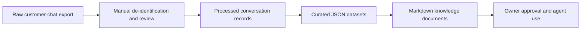

# Knowledge Pipeline v2

Knowledge Pipeline v2 converts approved, de-identified customer-chat insights into reusable business knowledge. It does not connect to Facebook or LINE and does not process chat files automatically.

## Folder tree

```text
knowledge/
├── raw/                 # Private source exports; ignored by Git
├── processed/           # Private de-identified review output; ignored by Git
├── datasets/
│   ├── schemas/         # JSON Schema contracts
│   └── README.md        # Dataset conventions
└── docs/
    ├── templates/       # Markdown rendering templates
    └── README.md        # Documentation conventions
```

## Data flow



Only curated datasets and their Markdown documents are intended for version control. Keep personal data and private conversation text in `raw/` or `processed/`.

## Operating sequence

1. Place a local source export in `raw/`; do not commit it.
2. Manually remove personal data and private text, then place the review output in `processed/`; do not commit it.
3. Curate approved aggregates into the corresponding `datasets/*.json` file using its schema.
4. Render or update the matching Markdown document from `docs/templates/`.
5. Obtain owner approval before using a dataset as agent knowledge.
