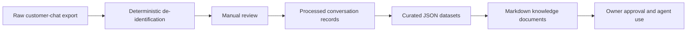

# Knowledge Pipeline v2

Knowledge Pipeline v2 converts approved, de-identified customer-chat insights into reusable business knowledge. It does not connect to Facebook or LINE and does not process chat files automatically.

## Folder tree

```text
knowledge/
├── raw/                 # Private source exports; ignored by Git
├── processed/           # Private de-identified review output; ignored by Git
├── datasets/
│   ├── schemas/         # JSON Schema contracts
│   └── README.md        # Dataset conventions
└── docs/
    ├── templates/       # Markdown rendering templates
    └── README.md        # Documentation conventions
```

## Data flow



Only curated datasets and their Markdown documents are intended for version control. Keep personal data and private conversation text in `raw/` or `processed/`.

## Operating sequence

1. Place a local source export in `raw/`; do not commit it.
2. Run `node scripts/deidentify.js` to copy `.txt` files to `processed/` with deterministic PII replacements. Raw files are read-only, and an existing processed file is never overwritten.
3. Manually review the processed output before curating any knowledge.
4. Normalize reviewed `.txt` conversations into canonical processed conversation records.
5. Curate approved aggregates into the corresponding `datasets/*.json` file using its schema.
6. Render or update the matching Markdown document from `docs/templates/`.
7. Obtain owner approval before using a dataset as agent knowledge.

## Deterministic de-identification

`scripts/deidentify.js` runs only on local `.txt` files under `knowledge/raw/` and writes the matching relative path under `knowledge/processed/`. It uses no AI or LLM and preserves all non-matching text exactly, including UTF-8 Thai text, blank lines, line ordering, and original line endings (LF or CRLF).

CLI usage:

- `node scripts/deidentify.js` — process files; exits non-zero on any safety violation without writing partial output for the failing plan.
- `node scripts/deidentify.js --dry-run` — list the relative paths that would be processed without writing anything.
- `DEIDENTIFY_RAW_DIR` / `DEIDENTIFY_PROCESSED_DIR` environment variables override the default directories (used by tests to avoid touching real data).

Console and error output never include file contents — only counts, relative paths, and the conflicting output path.

The first version recognizes common formats for:

- phone numbers → `[PHONE]`
- email addresses → `[EMAIL]`
- labeled LINE IDs → `[LINE_ID]`
- Thai names following labels such as `ชื่อ:` (up to two Thai words) or `คุณ ` (one Thai word) → `[PERSON]`
- addresses following labels such as `ที่อยู่:` or `ส่งที่:` → `[ADDRESS]`

These are conservative pattern matches, not a guarantee that all personal data has been removed. A person must review every processed file before it is used as business knowledge.

## Processed conversation normalization

`scripts/normalize_conversations.js` converts de-identified `.txt` files under `knowledge/processed/` into canonical JSON records. It does not extract FAQ, intents, objections, products, quotations, or other business knowledge.

Default output:

```bash
node scripts/normalize_conversations.js --output knowledge/datasets/drafts/processed_conversations.json
```

Dry run:

```bash
node scripts/normalize_conversations.js --dry-run --output knowledge/datasets/drafts/processed_conversations.json
```

Write to a directory:

```bash
node scripts/normalize_conversations.js --output knowledge/datasets/drafts
```

Overwrite only when intentional:

```bash
node scripts/normalize_conversations.js --force --output knowledge/datasets/drafts/processed_conversations.json
```

Add an explicit speaker prefix:

```bash
node scripts/normalize_conversations.js --prefix "Support:=agent" --output knowledge/datasets/drafts/processed_conversations.json
```

Default speaker prefixes:

- `Customer:` -> `customer`
- `Agent:` -> `agent`
- `ลูกค้า:` -> `customer`
- `แอดมิน:` -> `agent`

Safety rules:

- reads only `.txt` files from `knowledge/processed/`
- rejects inputs resolving inside `knowledge/raw/`
- rejects symlink inputs
- refuses output inside `knowledge/processed/`
- refuses output inside `knowledge/raw/`
- never overwrites output without `--force`
- validates output against `knowledge/datasets/schemas/processed_conversations.schema.json`
- does not log conversation content
