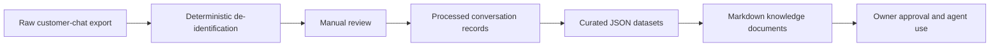

# Knowledge Pipeline v2

Knowledge Pipeline v2 converts approved, de-identified customer-chat insights into reusable business knowledge. It does not connect to Facebook or LINE and does not process chat files automatically.

## Folder tree

```text
knowledge/
├── raw/                 # Private source exports; ignored by Git
├── processed/           # Private de-identified review output; ignored by Git
├── datasets/
│   ├── schemas/         # JSON Schema contracts
│   └── README.md        # Dataset conventions
└── docs/
    ├── templates/       # Markdown rendering templates
    └── README.md        # Documentation conventions
```

## Data flow



Only curated datasets and their Markdown documents are intended for version control. Keep personal data and private conversation text in `raw/` or `processed/`.

## Operating sequence

1. Place a local source export in `raw/`; do not commit it.
2. Run `node scripts/deidentify.js` to copy `.txt` files to `processed/` with deterministic PII replacements. Raw files are read-only, and an existing processed file is never overwritten.
3. Manually review the processed output before curating any knowledge.
4. Normalize reviewed `.txt` conversations into canonical processed conversation records.
5. Curate approved aggregates into the corresponding `datasets/*.json` file using its schema.
6. Render or update the matching Markdown document from `docs/templates/`.
7. Obtain owner approval before using a dataset as agent knowledge.

## Deterministic de-identification

`scripts/deidentify.js` runs only on local `.txt` files under `knowledge/raw/` and writes the matching relative path under `knowledge/processed/`. It uses no AI or LLM and preserves all non-matching text exactly, including UTF-8 Thai text, blank lines, line ordering, and original line endings (LF or CRLF).

CLI usage:

- `node scripts/deidentify.js` — process files; exits non-zero on any safety violation without writing partial output for the failing plan.
- `node scripts/deidentify.js --dry-run` — list the relative paths that would be processed without writing anything.
- `DEIDENTIFY_RAW_DIR` / `DEIDENTIFY_PROCESSED_DIR` environment variables override the default directories (used by tests to avoid touching real data).

Console and error output never include file contents — only counts, relative paths, and the conflicting output path.

Path safety: directory comparisons resolve `.`/`..` and are case-insensitive on Windows; the output directory may never be the raw directory, overlap it, or sit anywhere inside the workspace `knowledge/raw/`; symbolic links in the input tree cause the run to fail instead of being silently skipped.

The first version recognizes common formats for:

- phone numbers → `[PHONE]`
- email addresses → `[EMAIL]`
- labeled LINE IDs → `[LINE_ID]`
- Thai names following labels such as `ชื่อ:` (up to two Thai words) or `คุณ ` (one Thai word) → `[PERSON]`
- addresses following labels such as `ที่อยู่:` or `ส่งที่:` → `[ADDRESS]`

These are conservative pattern matches, not a guarantee that all personal data has been removed. A person must review every processed file before it is used as business knowledge.

## Processed conversation normalization

`scripts/normalize_conversations.js` converts de-identified `.txt` files under `knowledge/processed/` into canonical JSON records. It does not extract FAQ, intents, objections, products, quotations, or other business knowledge.

Default output:

```bash
node scripts/normalize_conversations.js --output knowledge/datasets/drafts/processed_conversations.json
```

Dry run:

```bash
node scripts/normalize_conversations.js --dry-run --output knowledge/datasets/drafts/processed_conversations.json
```

Write to a directory:

```bash
node scripts/normalize_conversations.js --output knowledge/datasets/drafts
```

Overwrite only when intentional:

```bash
node scripts/normalize_conversations.js --force --output knowledge/datasets/drafts/processed_conversations.json
```

Add an explicit speaker prefix:

```bash
node scripts/normalize_conversations.js --prefix "Support:=agent" --output knowledge/datasets/drafts/processed_conversations.json
```

Default speaker prefixes:

- `Customer:` -> `customer`
- `Agent:` -> `agent`
- `ลูกค้า:` -> `customer`
- `แอดมิน:` -> `agent`

Safety rules:

- reads only `.txt` files from `knowledge/processed/`
- rejects inputs resolving inside `knowledge/raw/`
- rejects symlink inputs
- refuses output inside `knowledge/processed/`
- refuses output inside `knowledge/raw/`
- never overwrites output without `--force`
- validates output against `knowledge/datasets/schemas/processed_conversations.schema.json`
- does not log conversation content

## Customer chat evidence retrieval

`knowledge/` is the authoritative location for new customer-chat evidence infrastructure.
`aas-stone-agent/` remains legacy/compatibility-only and receives no new chat-evidence
features. New raw customer chats stay local under `knowledge/raw/`; they are never
committed. Run de-identification and manual review before indexing.

Milestone 1 flow:

```text
RAW local-only
→ deidentify
→ processed local-only
→ index
→ extracted candidate
→ human review
→ approved knowledge
→ optional owner-approved pricing rule change
```

The deterministic index is `knowledge/datasets/chat_index.json`. Build it from the
validated normalization output with:

```bash
node scripts/build_chat_index.js
```

The index stores source references, hashes, message ranges, and optional reviewed
search metadata; it never stores full conversation text. Retrieval APIs are in
`tools/chat_evidence.js` and use exact terms, controlled tags, dimensions, and dates.
There are no embeddings, vector DB calls, network calls, or LLM extraction in this
milestone.

Historical quotations extend `knowledge/datasets/schemas/quotations.schema.json` with
evidence pointers, `observed_quote` / `candidate_rule` / `exception` classification,
optional positive `quoted_price_thb`, and evidence-backed centimeter sizes. A historical
quote is not a current pricing rule. Size frequency is not an official standard size.
Response examples are evidence-backed examples, not universal response rules.
Changes to `data/pricing_rules.json` require explicit owner approval; this pipeline
never changes that file automatically. Raw customer chats and unnecessary PII are not
committed, and Milestone 1 keeps tracked evidence datasets empty.

## Evidence-backed customer response planning

`tools/customer_response_planner.js` assembles a deterministic response plan from a
normalized request. It does not call an LLM, send customer messages, or wire into
Telegram directly. The staff-only Telegram `/draft` command uses the existing
allowlist and renders the plan for review only; it never auto-sends or forwards a
customer response. The plan separates current pricing, historical quotation evidence,
response-style guidance, missing information, conflicts, and evidence pointers.

The draft assistant requires an authorized staff chat through
`TELEGRAM_ALLOWED_CHAT_IDS`. Unauthorized chats are ignored by the existing staff
access-control layer. It exposes only concise evidence pointers such as chunk IDs,
never raw conversations, local file paths, customer profiles, or unnecessary PII.

The staff lifecycle is `/draft` -> `/target <draft_id> <customer_chat_id>` ->
`/approve <draft_id>`. Targets are explicit numeric Telegram chat IDs and are
never inferred from conversations, evidence, names, or quotations. Pending drafts
are held in memory for 15 minutes, then fail closed. Only `ready` drafts with a
bound target can send. `needs_information`, `conflict`, and `unsupported` drafts
cannot be sent.

The prepared customer payload is fingerprinted at draft creation and sent exactly
once through the existing Telegram client. Clear send failures remain retryable by
an explicit staff retry; ambiguous failures block retry to reduce duplicate-send
risk. `/draft` and `/target` never send, and there is no automatic customer reply,
background retry, or scheduled send.

Authority order is:

```text
current pricing engine → historical quotation evidence → reviewed response style
```

`data/pricing_rules.json` and `tools/pricing_engine.js` remain authoritative for
computed/current pricing. Historical quotations explain evidence only and never
override the engine or modify pricing rules. Response-style examples guide question
sequence, price explanation, negotiation, objection response, closing, and terminology;
they do not add factual claims or prices.

The planner uses these states:

```text
ready             complete pricing conditions and no unresolved conflict
needs_information required product/material/dimension information is missing
conflict          relevant historical evidence conflicts with current calculation
unsupported       malformed or unsupported request/evidence/pricing condition
```

`ready` is a reviewable plan, not an automatic customer reply. `needs_information`
lists follow-up questions, `conflict` keeps unresolved pricing evidence conflicts
visible, and `unsupported` fails closed. Current output from the pricing engine is
authoritative; historical quotations remain informational only.

Unresolved `price_mismatch`, `unknown_material`, `unsupported_dimension`, and
`insufficient_conditions` findings are surfaced without auto-resolution. Raw and
processed conversations remain local-only, tracked outputs contain pointers rather
than full chat text, and no customer profile or PII enrichment is performed.
